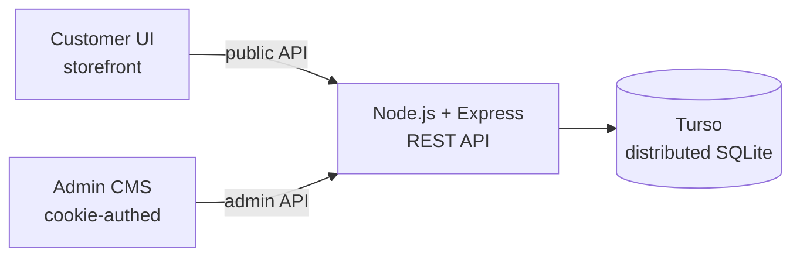
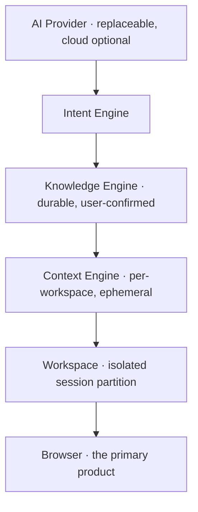

<h1 align="center">Jhon Buerano</h1>

  <strong>AI Automation Engineer · Full Stack Developer</strong> 
  I build production software that removes complexity instead of adding more.

  
  
  

---

## About

I design and ship systems end to end — architecture, backend, frontend, deployment, and the
documentation that makes them maintainable by someone who isn't me.

My work sits at the intersection of **AI automation**, **full stack engineering**, and
**browser/desktop tooling**. The common thread is reducing moving parts: a shipped system with two
runtime dependencies beats an unshipped one with forty.

Most of what I build is **operated by real people, in production, without a developer in the loop.**

> Build software that removes complexity instead of adding more.

---

## Current Focus

| Area | What I'm doing with it |
|---|---|
| **AI Agents** | Agent loops, tool design, and orchestration for real workflows — not demos |
| **Claude Code / Anthropic API** | Agentic development workflows, MCP servers, skill and tool authoring |
| **Browser Engineering** | Chromium/Electron internals — session isolation, lifecycle, process management |
| **Full Stack Development** | Node.js services, REST design, SQLite/Turso, zero-build frontends |
| **AI Automation** | Turning manual business operations into self-healing automated systems |
| **Workflow Systems** | Inventory, ledger, and order-lifecycle engines where correctness is non-negotiable |

---

## Featured Projects

### Wave3 Collective PH — Production E-Commerce Platform & Custom CMS

A full storefront and admin CMS built from scratch for a real Philippine streetwear brand. No
Shopify, no WordPress, no templates. **Shipped to production and sold out its first product batch.**
The owner runs the entire business through the CMS daily, with no developer involved.

**Why it exists:** the business sells through GCash and bank transfer with a hand-verified payment
screenshot — a workflow hosted checkouts aren't built around. Wave3 makes it first-class: reserve
stock → upload proof → verify → approve, with a payment window that auto-expires unpaid orders and
restocks them.

**One decision worth reading:** all media lives *in the database*, not on disk or S3. The free
hosting tier's filesystem doesn't survive redeploys. Object storage is the textbook answer at
scale — at this scale it would have added a paid dependency for no gain. The deployment constraint
drove the architecture, not the other way around.

  
  
  
  
  

**[Live site](https://wave3collectiveph.com)** · **[Case study](https://wave3-portfolio.netlify.app)** · **[Repository](https://github.com/jhon-hub-work/wave3)**

---

### Obsidian Browser — Workspace-First Browser for Builders

A Chromium/Electron browser that optimizes for *work* rather than consumption. Not a Chrome clone,
and deliberately **not an AI browser** — the browser layer must be excellent with the AI turned
entirely off.

**Why it exists:** every browser is built for reading the web. None are built for building things —
holding projects, context, and tools in one keyboard-first environment that remembers where you left
off and gets smarter the longer you use it.

**One decision worth reading:** the architecture is strictly layered, and **AI is the topmost layer,
never the foundation.** Workspaces get real isolation via per-workspace Chromium session partitions
(`persist:ws-<id>`) — separate cookies, logins, cache, and history — not just visual grouping. And
Knowledge only grows through *confirmed user actions*, never passive observation. That line between
ephemeral Context and durable Knowledge is the hardest constraint in the system.

  
  
  
  

**[Repository](https://github.com/jhon-hub-work/ObsidianBrowser)** · [Architecture](https://github.com/jhon-hub-work/ObsidianBrowser/blob/main/ARCHITECTURE.md) · [Roadmap](https://github.com/jhon-hub-work/ObsidianBrowser/blob/main/ROADMAP.md)

---

### Portfolio — Conversion-First Engineering Site

A hand-built portfolio and long-form case study site. Zero framework, zero build step — the same
constraint discipline as Wave3, applied to a site whose only job is to make a technical reader
understand the work in under two minutes.

  
  
  
  

**[Live site](https://jhonmbuerano.netlify.app)**

---

## How I Work

**Constraints first.** I design around the real limits — free-tier ephemeral disks, one admin user,
a non-technical operator — instead of designing for imaginary scale and paying for it immediately.

**Fewer moving parts.** Wave3 runs on two runtime dependencies. Every dependency, framework, and
service has to earn its place against the cost of operating it solo.

**Correctness where it counts.** The most valuable engineering in Wave3 wasn't a screen — it was
guaranteeing two simultaneous buyers can never purchase the same last unit. That's transactional,
tested, and boring on purpose.

**Documentation is part of the deliverable.** If a system can't be understood from its README, it
isn't finished.

---

## Toolbox

| | |
|---|---|
| **Languages** | JavaScript · Node.js · SQL · HTML · CSS |
| **Frontend** | React · vanilla JS architecture · responsive CSS · zero-build delivery |
| **Backend** | Express · REST API design · SQLite · Turso (libSQL) · PostgreSQL · session auth |
| **Desktop** | Electron · Chromium session & process model · IPC / preload isolation |
| **AI** | Claude Code · Anthropic API · OpenAI · Gemini · MCP servers · agent & tool design |
| **Automation** | n8n · Make · Zapier · workflow design |
| **Infra** | Render · Netlify · Docker · environment-driven config · custom domains + SSL |

---

  Open to senior full stack, AI automation, and founding engineer roles. 
  <a href="https://jhonmbuerano.netlify.app">Portfolio</a> · <a href="https://www.linkedin.com/in/jhon-mycho-buerano">LinkedIn</a> · <a href="mailto:bueranojhon@gmail.com">bueranojhon@gmail.com</a>

