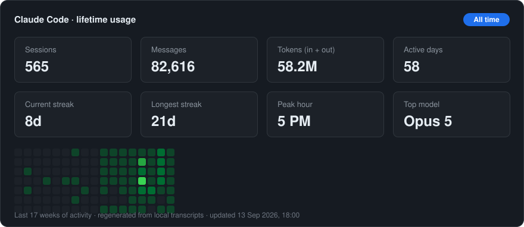
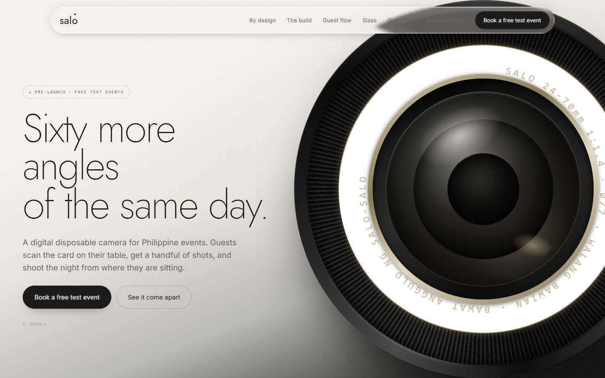
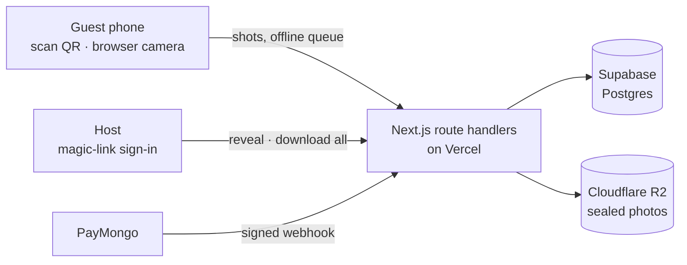
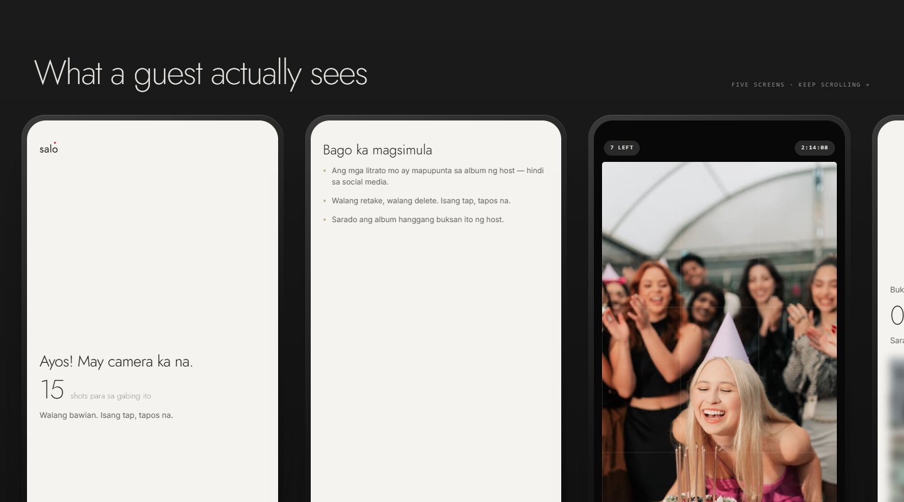
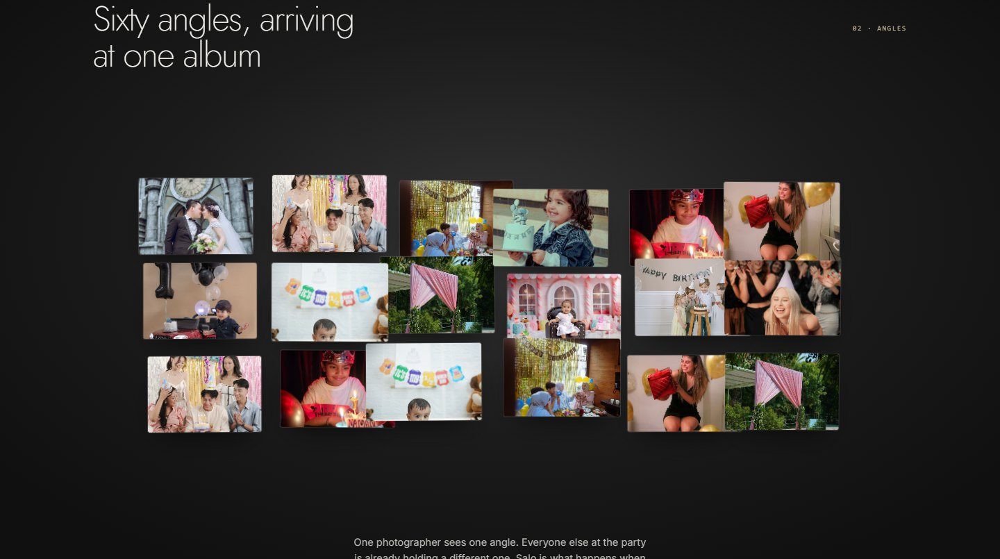
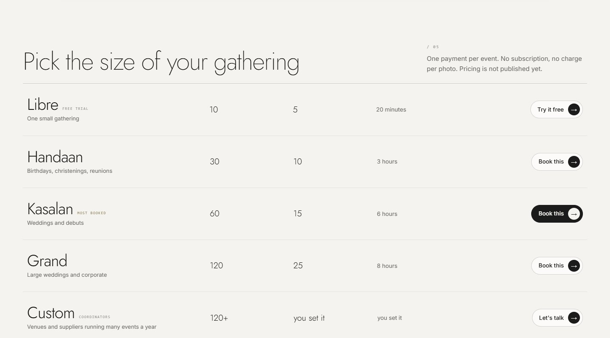
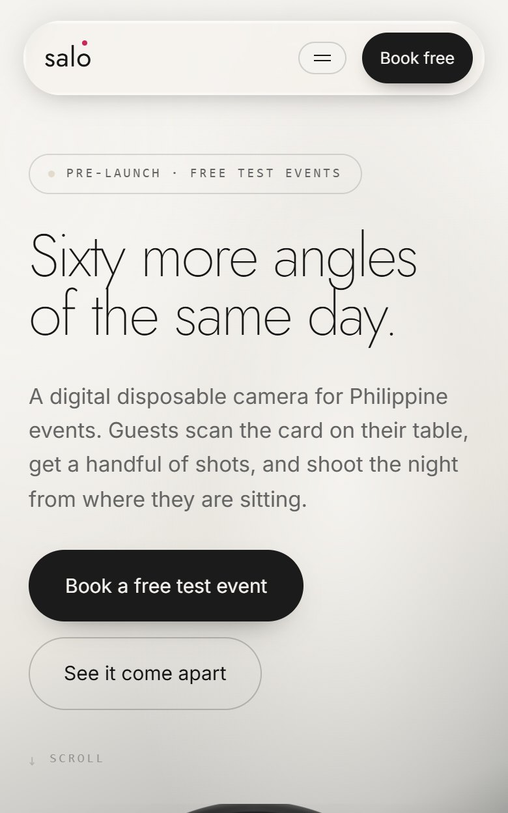
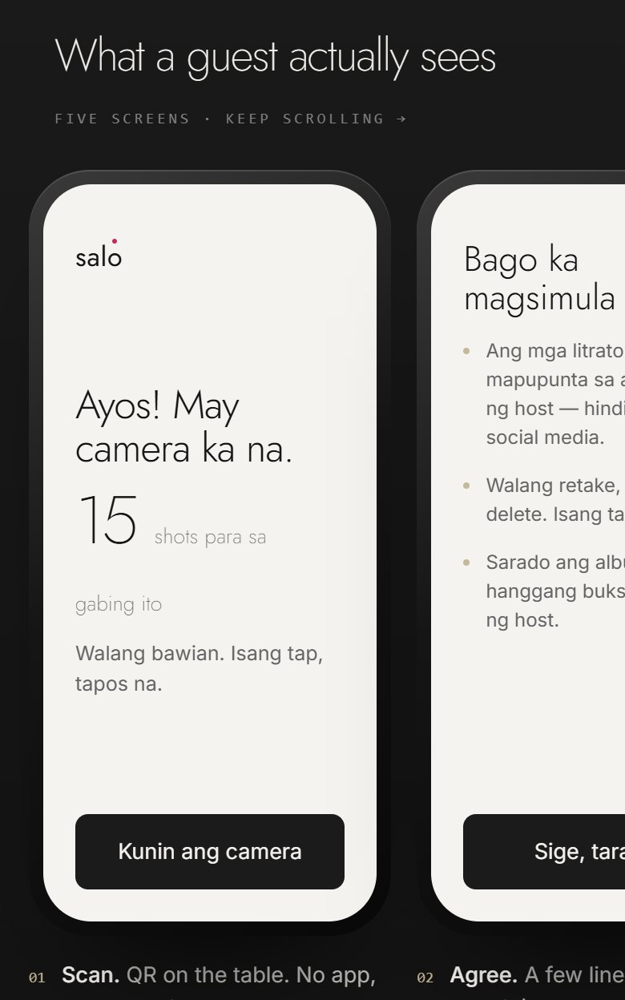
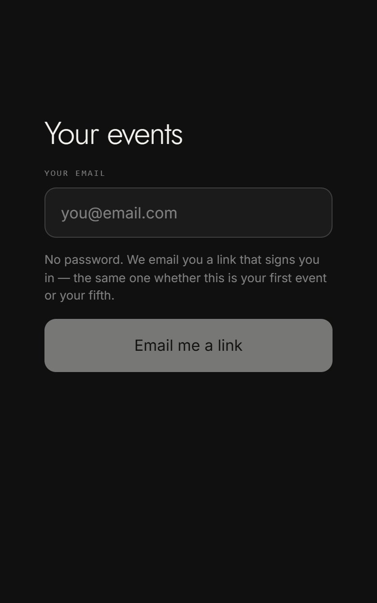
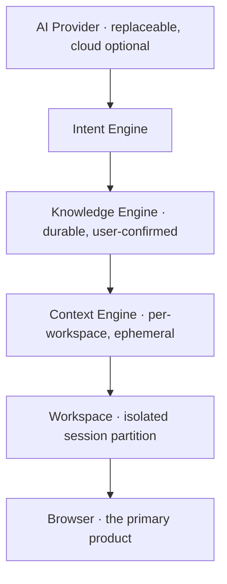

<h1 align="center">Jhon Buerano</h1>

  <strong>AI Automation Engineer · Full Stack Developer</strong> 
  I build production software that removes complexity instead of adding more.

  
  
  

---

## About

I design and ship systems end to end — architecture, backend, frontend, deployment, and the
documentation that makes them maintainable by someone who isn't me.

My work sits at the intersection of **AI automation**, **full stack engineering**, and
**browser/desktop tooling**. The common thread is reducing moving parts: a shipped system with two
runtime dependencies beats an unshipped one with forty.

Most of what I build is **operated by real people, in production, without a developer in the loop.**

> Build software that removes complexity instead of adding more.

---

## Current Focus

| Area | What I'm doing with it |
|---|---|
| **AI Agents** | Agent loops, tool design, and orchestration for real workflows — not demos |
| **Claude Code / Anthropic API** | Agentic development workflows, agent loops, and automated rendering pipelines |
| **Browser Engineering** | Chromium/Electron internals — session isolation, lifecycle, process management |
| **Full Stack Development** | Node.js services, REST design, SQLite/Turso, zero-build frontends |
| **AI Automation** | Turning manual business operations into self-healing automated systems |
| **Workflow Systems** | Inventory, ledger, and order-lifecycle engines where correctness is non-negotiable |

---

## Claude Code, In Practice

I don't use AI to autocomplete lines — I use it as a build system. Agent loops and rendering pipelines
that run unattended. This is the real usage behind the projects
below — the card is regenerated from my local Claude Code transcripts by
[`scripts/build_stats.py`](scripts/build_stats.py) and pushed automatically, so it is never stale.

  

---

## Featured Projects

### Salo — A Digital Disposable Camera for Philippine Events

  

Guests scan the QR card on their table, get a fixed handful of shots, and shoot the night from
where they are sitting. No app to download, no account, no retakes, no preview screen. Every
photo lands in one album that stays sealed until the host opens it. Built for weddings, debuts,
birthdays, christenings and reunions, with Taglish copy and GCash-first payments.

**Why it exists:** the official photographer sees one angle. Everyone else in the room is already
holding a different one, and those photos end up scattered across fifty camera rolls. Limiting
each guest to a few shots is the point, not a missing feature. When every frame counts, people stop
posing and start noticing the room.

**One decision worth reading:** *payment creates the event, not the browser.* The QR only exists
once PayMongo's webhook says the money arrived. The signature is checked against the raw request
body before anything runs, and anything unrecognised is refused. I tested it by attacking it:
unsigned, garbage-signed and wrong-secret webhooks get 401, a retried webhook is recognised and
not processed twice, and paying ₱1 for a ₱2,499 package gets 409. A redirect back from a checkout
page proves nothing, so the product never trusts one.

**Proven on real phones, not asserted.** A Galaxy S25 FE on Chrome and an iPhone on Safari both
ran the whole guest flow against a live event. iOS Safari gave a real in-browser viewfinder, which
was the biggest risk in the "no guest app" decision. With Wi-Fi off, four photos queued and all
arrived. A whole guest session used about 340 KB. The guest page loads in 0.93 s cold in
production.

```mermaid
flowchart LR
    G["Guest phone<br/>scan QR · browser camera"] -->|shots, offline queue| API
    H["Host<br/>magic-link sign-in"] -->|reveal · download all| API
    P["PayMongo"] -->|signed webhook| API
    API["Next.js route handlers<br/>on Vercel"] --> DB[("Supabase<br/>Postgres")]
    API --> R2[("Cloudflare R2<br/>sealed photos")]
```

  
  
  
  
  
  
  
  

**[Live site](https://saloph.com)** · **[Repository (private)](https://github.com/jhon-hub-work/salo)**

<table>
  <tr>
    <td width="50%"></td>
    <td width="50%"></td>
  </tr>
  <tr>
    <td colspan="2"></td>
  </tr>
</table>

  
  
  

Also shipped: a host Android app (a verified Trusted Web Activity), a founder console with staff
accounts and an append-only audit log, and a ledger. The console sits behind a secret path and
answers 404 to anyone who isn't signed in.

---

### Obsidian Browser — Workspace-First Browser for Builders

A Chromium/Electron browser that optimizes for *work* rather than consumption. Not a Chrome clone,
and deliberately **not an AI browser** — the browser layer must be excellent with the AI turned
entirely off.

**Why it exists:** every browser is built for reading the web. None are built for building things —
holding projects, context, and tools in one keyboard-first environment that remembers where you left
off and gets smarter the longer you use it.

**One decision worth reading:** the architecture is strictly layered, and **AI is the topmost layer,
never the foundation.** Workspaces get real isolation via per-workspace Chromium session partitions
(`persist:ws-<id>`) — separate cookies, logins, cache, and history — not just visual grouping. And
Knowledge only grows through *confirmed user actions*, never passive observation. That line between
ephemeral Context and durable Knowledge is the hardest constraint in the system.

```mermaid
flowchart TD
    AI["AI Provider · replaceable, cloud optional"] --> IE["Intent Engine"]
    IE --> KE["Knowledge Engine · durable, user-confirmed"]
    KE --> CE["Context Engine · per-workspace, ephemeral"]
    CE --> WS["Workspace · isolated session partition"]
    WS --> BR["Browser · the primary product"]
```

  
  
  
  

**[Repository](https://github.com/jhon-hub-work/ObsidianBrowser)** · [Architecture](https://github.com/jhon-hub-work/ObsidianBrowser/blob/main/ARCHITECTURE.md) · [Roadmap](https://github.com/jhon-hub-work/ObsidianBrowser/blob/main/ROADMAP.md)

<table>
  <tr>
    <td width="50%"></td>
    <td width="50%"></td>
  </tr>
  <tr>
    <td></td>
    <td></td>
  </tr>
</table>

---

### Wave3 Collective PH — E-Commerce Platform & Custom CMS

A storefront and admin CMS built from scratch for a Philippine streetwear brand. No Shopify, no
WordPress, no templates. It went live and sold out its first batch, and the owner runs the
business through it without a developer. It makes the GCash and bank-transfer checkout
first-class: stock is reserved, the buyer uploads a payment screenshot, and an admin verifies it.
Unpaid orders expire and go back on the shelf. All media lives in the database, because the free
hosting tier wipes its disk on every redeploy.

  
  
  
  

**[Live site](https://wave3collectiveph.com)** · **[Case study](https://wave3-portfolio.netlify.app)** · **[Repository (private)](https://github.com/jhon-hub-work/wave3)**

<table>
  <tr>
    <td width="50%"></td>
    <td width="50%"></td>
  </tr>
</table>

---

### Portfolio — Conversion-First Engineering Site

A hand-built portfolio and long-form case study site. Zero framework, zero build step — the same
constraint discipline as Wave3, applied to a site whose only job is to make a technical reader
understand the work in under two minutes.

  
  
  
  

**[Live site](https://jhonmbuerano.netlify.app)**

---

## All Public Repositories

| Repository | What it is | Stack |
|---|---|---|
| **[ObsidianBrowser](https://github.com/jhon-hub-work/ObsidianBrowser)** | Workspace-first Chromium browser for builders. Local-first, per-workspace session isolation, network-level ad blocking. | Electron · Chromium · Node.js |
| **[portfolio](https://github.com/jhon-hub-work/portfolio)** · [live](https://jhonmbuerano.netlify.app) | Conversion-first portfolio and long-form Wave3 engineering case study. No framework, no build step, no dependencies. | HTML · CSS · Vanilla JS · Netlify |
| **[jhon-hub-work](https://github.com/jhon-hub-work/jhon-hub-work)** | This profile README. | Markdown |

**Private:** `salo` (event photo app, live at [saloph.com](https://saloph.com), in beta) and
`wave3` (e-commerce platform and CMS, operated daily by a non-technical owner). The source is
closed; the sections and screenshots above cover the architecture and the decisions.

**Also working in:** [hyperframes](https://github.com/jhon-hub-work/hyperframes) (HTML-to-video
rendering for agents) and [barehands](https://github.com/jhon-hub-work/barehands) (webcam hand
tracking as an AI interface) — forks I build on top of, not original work.

---

## How I Work

**Constraints first.** I design around the real limits — free-tier ephemeral disks, one admin user,
a non-technical operator — instead of designing for imaginary scale and paying for it immediately.

**Fewer moving parts.** Wave3 runs on two runtime dependencies. Every dependency, framework, and
service has to earn its place against the cost of operating it solo.

**Correctness where it counts.** The most valuable engineering in Salo isn't a screen. It's making
sure an event only exists once a signed payment proves it, and that a forged or repeated
payment message changes nothing. In Wave3 it was making sure two buyers can never both get the
last unit. Both are tested and boring on purpose.

**Documentation is part of the deliverable.** If a system can't be understood from its README, it
isn't finished.

---

## Toolbox

| | |
|---|---|
| **Languages** | JavaScript · Node.js · SQL · HTML · CSS |
| **Frontend** | React · vanilla JS architecture · responsive CSS · zero-build delivery |
| **Backend** | Express · REST API design · SQLite · Turso (libSQL) · PostgreSQL · session auth |
| **Desktop** | Electron · Chromium session & process model · IPC / preload isolation |
| **AI** | Claude Code · Anthropic API · OpenAI · Gemini · Ollama · n8n · agent workflow design |
| **Automation** | n8n · Make · Zapier · workflow design |
| **Infra** | Render · Netlify · Docker · environment-driven config · custom domains + SSL |

---

  Open to senior full stack, AI automation, and founding engineer roles. 
  <a href="https://jhonmbuerano.netlify.app">Portfolio</a> · <a href="https://www.linkedin.com/in/jhon-mycho-buerano">LinkedIn</a> · <a href="mailto:bueranojhon@gmail.com">bueranojhon@gmail.com</a>

